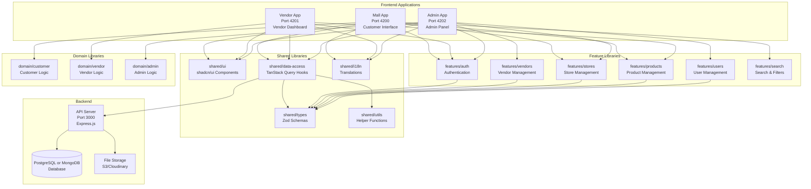
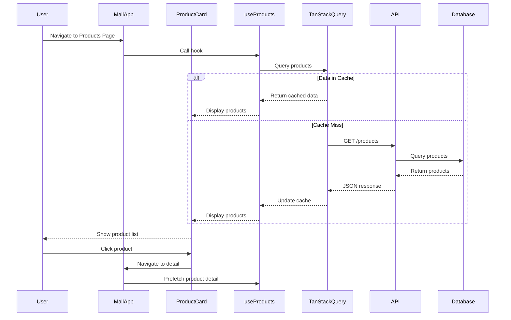
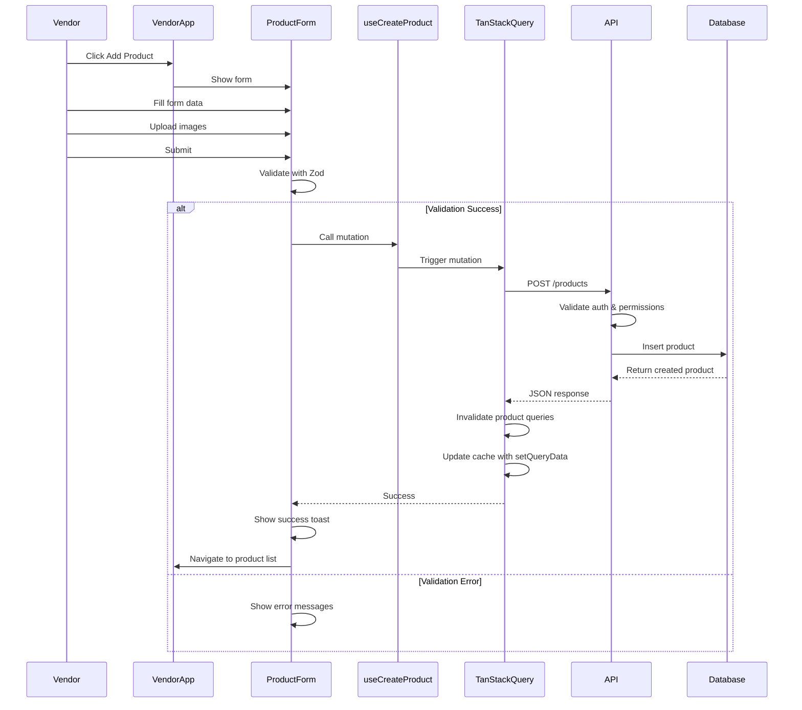
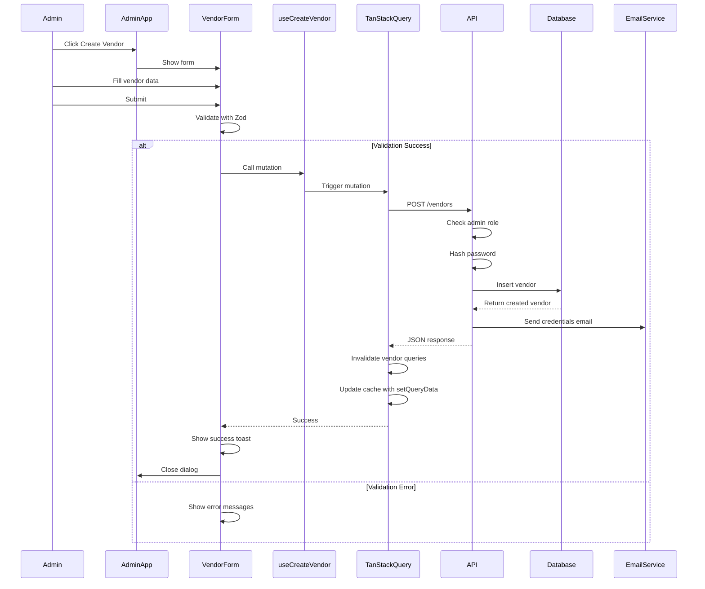
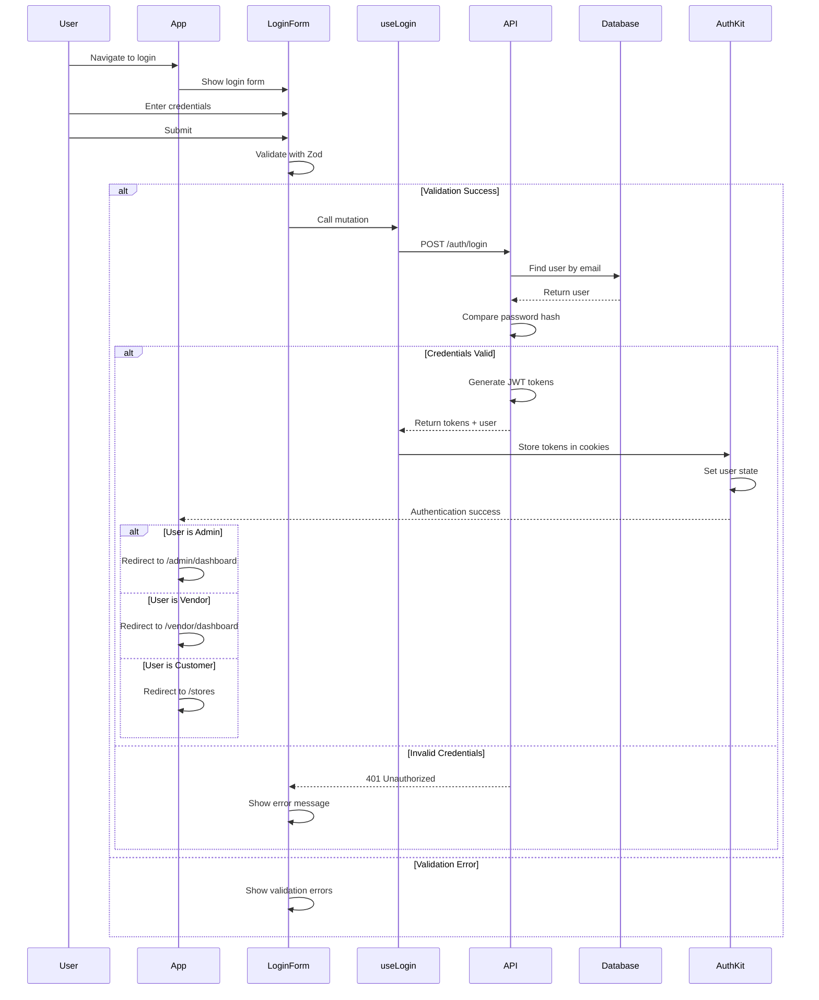
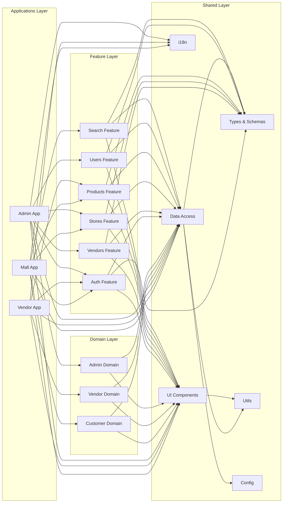
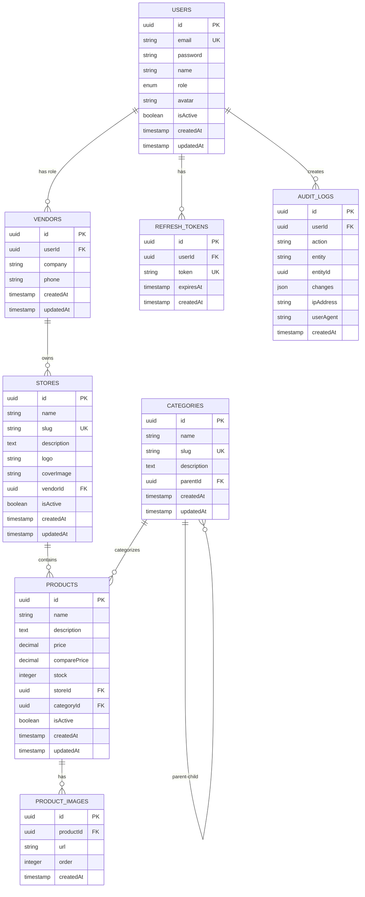
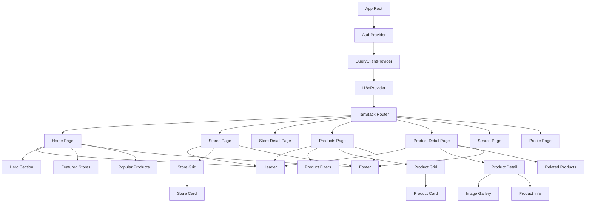
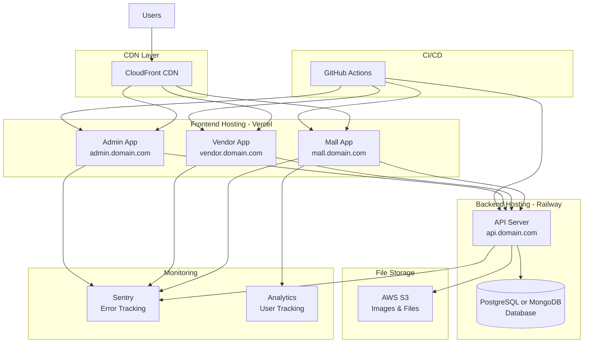

# E-Commerce Platform - Architecture Diagrams

## System Architecture Overview



---

## Data Flow - Customer Browsing Products



---

## Data Flow - Vendor Creating Product



---

## Data Flow - Admin Creating Vendor



---

## Authentication Flow



---

## Library Dependency Graph



---

## Database Schema



---

## Component Hierarchy - Mall App



---

## Deployment Architecture



---

## Technology Stack Layers

```mermaid
graph TB
    subgraph "Presentation Layer"
        React[React 19]
        TailwindCSS[Tailwind CSS]
        ShadcnUI[shadcn/ui]
        Storybook[Storybook]
    end

    subgraph "State Management Layer"
        TanStackQuery[TanStack Query<br/>Server State]
        Zustand[Zustand<br/>Client State]
        ReactHookForm[React Hook Form<br/>Form State]
    end

    subgraph "Routing & Navigation"
        TanStackRouter[TanStack Router]
    end

    subgraph "Authentication Layer"
        ReactAuthKit[react-auth-kit]
        JWT[JWT Tokens]
    end

    subgraph "Validation Layer"
        Zod[Zod Schemas]
    end

    subgraph "API Layer"
        Axios[Axios HTTP Client]
    end

    subgraph "Backend Layer"
        Express[Express.js]
        Prisma[Prisma ORM]
    end

    subgraph "Database Layer"
        PostgreSQL[PostgreSQL] or
        MongoDB[MongoDB]
    end

    subgraph "Build & Dev Tools"
        Nx[Nx Monorepo]
        Vite[Vite Bundler]
        TypeScript[TypeScript]
    end

    React --> TanStackQuery
    React --> Zustand
    React --> ReactHookForm
    React --> TanStackRouter
    React --> ReactAuthKit
    React --> ShadcnUI

    ReactHookForm --> Zod
    TanStackQuery --> Axios
    ReactAuthKit --> JWT

    Axios --> Express
    Express --> Prisma
    Prisma --> PostgreSQL or MongoDB

    Nx --> Vite
    Vite --> TypeScript
```

---

## Notes

These diagrams provide a visual representation of:

1. **System Architecture** - How all components fit together
2. **Data Flows** - How data moves through the system
3. **Authentication** - How users log in and access resources
4. **Dependencies** - How libraries depend on each other
5. **Database Schema** - How data is structured
6. **Component Hierarchy** - How UI components are organized
7. **Deployment** - How the system is deployed to production
8. **Technology Stack** - How technologies layer on each other

Use these diagrams as reference when implementing the system to understand the big picture and how components interact.
